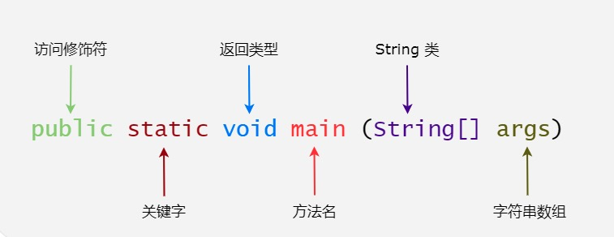

# Java 基础语法
一个 Java 程序可以认为是一系列对象的集合，而这些对象通过调用彼此的方法来协同工作。下面简要介绍下类、对象、方法和实例变量的概念。

+ 对象：对象是类的一个实例，有状态和行为。例如，一条狗是一个对象，它的状态有：颜色、名字、品种；行为有：摇尾巴、叫、吃等。
+ 类：类是一个模板，它描述一类对象的行为和状态。
+ 方法：方法就是行为，一个类可以有很多方法。逻辑运算、数据修改以及所有动作都是在方法中完成的。
+ 实例变量：每个对象都有独特的实例变量，对象的状态由这些实例变量的值决定。

## 第一个Java程序
下面看一个简单的 Java 程序，它将输出字符串 Hello World

```java
public class HelloWorld {
    /* 第一个Java程序
     * 它将输出字符串 Hello World
     */
    public static void main(String[] args) {
        System.out.println("Hello World"); // 输出 Hello World
    }
}
```
如图：

