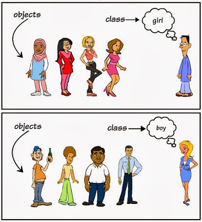
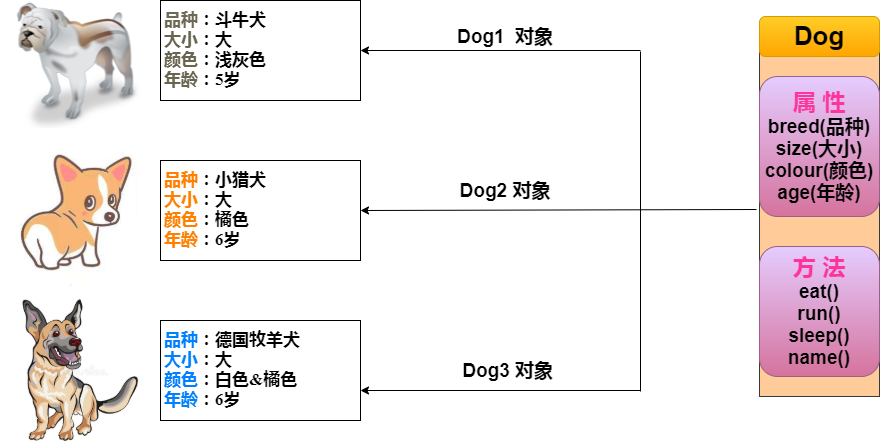

# Java 对象和类
Java作为一种面向对象语言。支持以下基本概念：

+ 多态
+ 继承
+ 封装
+ 抽象
+ 类
+ 对象
+ 实例
+ 方法
+ 重载
本节我们重点研究对象和类的概念。

对象：对象是类的一个实例（对象不是找个女朋友），有状态和行为。例如，一条狗是一个对象，它的状态有：颜色、名字、品种；行为有：摇尾巴、叫、吃等。
类：类是一个模板，它描述一类对象的行为和状态。
下图中男孩（boy）、女孩（girl）为类（class），而具体的每个人为该类的对象（object）：

## Java中的对象
现在让我们深入了解什么是对象。看看周围真实的世界，会发现身边有很多对象，车，狗，人等等。所有这些对象都有自己的状态和行为。

拿一条狗来举例，它的状态有：名字、品种、颜色，行为有：叫、摇尾巴和跑。

对比现实对象和软件对象，它们之间十分相似。

软件对象也有状态和行为。软件对象的状态就是属性，行为通过方法体现。

在软件开发中，方法操作对象内部状态的改变，对象的相互调用也是通过方法来完成。

## Java 中的类
类可以看成是创建 Java 对象的模板。

通过上图创建一个简单的类来理解下 Java 中类的定义：
```java
public class Dog {
    String breed;
    int size;
    String colour;
    int age;
 
    void eat() {
    }
 
    void run() {
    }
 
    void sleep(){
    }
 
    void name(){
    }
}
```
一个类可以包含以下类型变量：
+ 局部变量：在方法、构造方法或者语句块中定义的变量被称为局部变量。变量声明和初始化都是在方法中，方法结束后，变量就会自动销毁。
+ 成员变量：成员变量是定义在类中，方法体之外的变量。这种变量在创建对象的时候实例化。成员变量可以被类中方法、构造方法和特定类的语句块访问。
+ 类变量：类变量也声明在类中，方法体之外，但必须声明为 static 类型。
一个类可以拥有多个方法，在上面的例子中：eat()、run()、sleep() 和 name() 都是 Dog 类的方法。
## 构造方法
每个类都有构造方法。如果没有显式地为类定义构造方法，Java 编译器将会为该类提供一个默认构造方法。

在创建一个对象的时候，至少要调用一个构造方法。构造方法的名称必须与类同名，一个类可以有多个构造方法。

下面是一个构造方法示例：
```java
public class Puppy{
    public Puppy(){
    }
 
    public Puppy(String name){
        // 这个构造器仅有一个参数：name
    }
}
```
