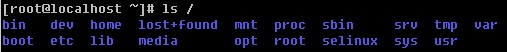
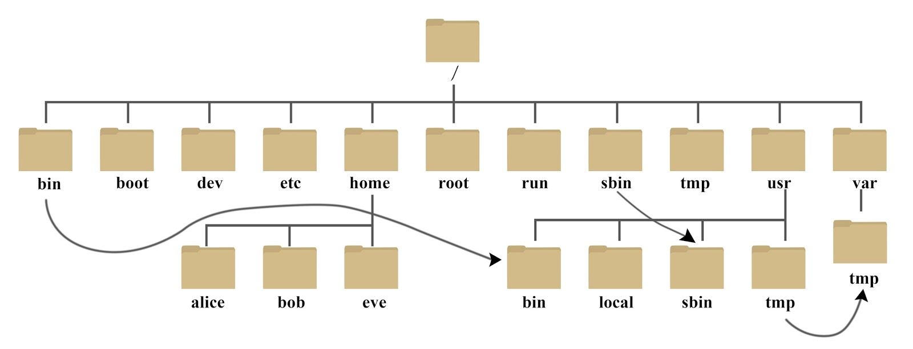

# Linux 系统目录结构
登录系统后，在当前命令窗口下输入命令：
```shell
ls
```
你会看到如下图所示:

树状目录结构：

以下是对这些目录的解释：

+ /bin：
  bin 是 Binaries (二进制文件) 的缩写, 这个目录存放着最经常使用的命令。
+ /boot：
  这里存放的是启动 Linux 时使用的一些核心文件，包括一些连接文件以及镜像文件。
+ /dev ：
  dev 是 Device(设备) 的缩写, 该目录下存放的是 Linux 的外部设备，在 Linux 中访问设备的方式和访问文件的方式是相同的。
+ /etc：
  etc 是 Etc、etera(等等) 的缩写,这个目录用来存放所有的系统管理所需要的配置文件和子目录。
+ /home：
  用户的主目录，在 Linux 中，每个用户都有一个自己的目录，一般该目录名是以用户的账号命名的，如上图中的 alice、bob 和 eve。
+ /lib：
  lib 是 Library(库) 的缩写这个目录里存放着系统最基本的动态连接共享库，其作用类似于 Windows 里的 DLL 文件。几乎所有的应用程序都需要用到这些共享库。
+ /lost+found：
  这个目录一般情况下是空的，当系统非法关机后，这里就存放了一些文件。
+ /media：
  linux 系统会自动识别一些设备，例如U盘、光驱等等，当识别后，Linux 会把识别的设备挂载到这个目录下。
+ /mnt：
  系统提供该目录是为了让用户临时挂载别的文件系统的，我们可以将光驱挂载在 /mnt/ 上，然后进入该目录就可以查看光驱里的内容了。
+ /opt：
  opt 是 optional(可选) 的缩写，这是给主机额外安装软件所摆放的目录。比如你安装一个ORACLE数据库则就可以放到这个目录下。默认是空的。
+ /proc：
  proc 是 Processes(进程) 的缩写，/proc 是一种伪文件系统（也即虚拟文件系统），存储的是当前内核运行状态的一系列特殊文件，这个目录是一个虚拟的目录，它是系统内存的映射，我们可以通过直接访问这个目录来获取系统信息。
  这个目录的内容不在硬盘上而是在内存里，我们也可以直接修改里面的某些文件，比如可以通过下面的命令来屏蔽主机的ping命令，使别人无法ping你的机器：
```shell
echo 1 > /proc/sys/net/ipv4/icmp_echo_ignore_all
```
