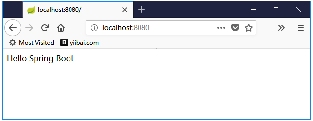

# Spring Boot快速入门
系统需要具有以下创建Spring Boot应用程序的最低要求

+ Java 7
+ Maven 3.2
+ Gradle 2.5

## Spring Boot CLI
Spring Boot CLI是一个命令行工具，它用于运行Groovy脚本。它是使用Spring Boot命令行界面创建Spring Boot应用程序的最简单方法。可以在命令提示符下创建，运行和测试应用程序。
本节介绍手动安装Spring Boot CLI所涉及的步骤。 如需进一步的帮助，可以使用以下[链接](https://docs.spring.io/spring-boot/docs/current-SNAPSHOT/reference/htmlsingle/#getting-started-installing-spring-boot):


## 使用Groovy运行Hello World
创建一个包含Rest Endpoint脚本的简单groovy文件：hello.groovy，并使用spring boot CLI运行groovy文件。代码如下所示
```java
@Controller
class Example {
   @RequestMapping("/")
   @ResponseBody
   public String hello() {
      "Hello Spring Boot"
   }
}
```

请注意，在这个示例中，已经配置Spring Boot CLI bin目录到系统环境变量，并把文件：hello.groovy保存到D:/worksp/springboot/目录。使用命令spring run hello.groovy运行应用程序，如下面所示
```shell
D:\worksp\springboot>spring run hello.groovy
```

